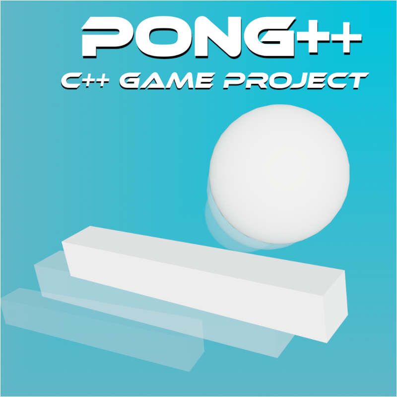

# PONG++

  

Basic pong game made with C++ and the Raylib library.

## Gameplay 🎮

Like any other Pong game, the player must prevent the ball from getting past their paddle while trying to score by getting the ball past the opponent's paddle.

The first to reach 10 points wins the match.

  

## How to compile

### Linux 🐧

1. Make sure Raylib is installed on your system. You can usually install it via your package manager.

Debian-based systems:

`sudo apt install libraylib-dev`

Arch-based systems:

`sudo pacman -S raylib`

2. Type the following line to compile

`g++ main.cpp mainMenu.cpp button.cpp winScreen.cpp  -o pong -lraylib -lGL -lm -lpthread -ldl -lrt -lX11`

3. This will create an executable file named **pong**.

4. Run the game and enjoy!

### Windows 🪟

1. Make sure you have **MinGW** installed and added to your system's path.

2. Download and set up **Raylib**. You can get the Windows version from the [Raylin Offcial Website](https://www.raylib.com/)

3. Compile the game using the following command (replace paths with the actual locations of Raylib on your system):

`g++ main.cpp mainMenu.cpp button.cpp winScreen.cpp -o pong.exe -IC:\raylib\include -LC:\raylib\lib -lraylib -lopengl32 -lgdi32 -lwinmm`

3. This will create an executable file named **pong.exe**.

4. Run the game and enjoy!

### MacOS 🍎

1. Make sure Xcode Command Line Tools are installed:

`xcode-select --install`

2. Install **Raylib**

`brew install raylib`

3. Compile the game using the following command:

`g++ main.cpp mainMenu.cpp button.cpp winScreen.cpp -o pong -std=c++17 -lraylib -framework OpenGL -framework Cocoa -framework IOKit -framework CoreAudio -framework CoreVideo`

3. This will create an executable file named **pong**.

4. Run the game and enjoy!

## Free Usage 🆓

I made this game for educational purposes, with the goal of learning and improving my skills in C++ programming.

Feel free to clone it, modify it, and make any changes you like 😁.
